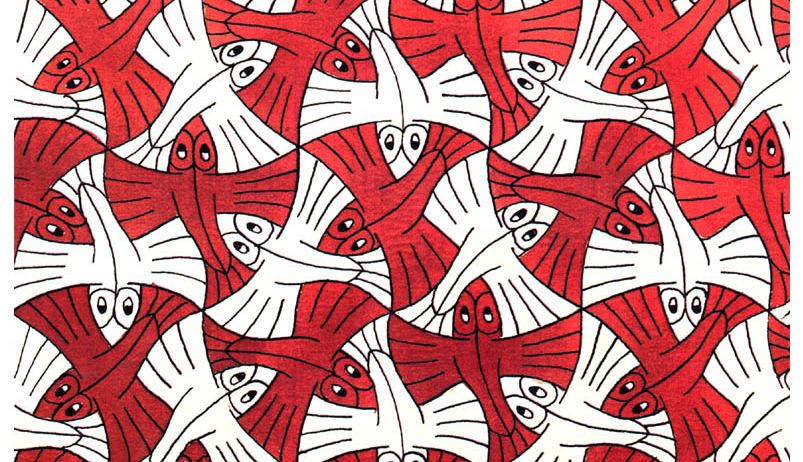

# ckuo4528_9103_tut2
## Quiz 8 

### **Part one: Imaging Technique Inspiration**

1. The imaging technique that I've chosen is artist MC Escher's iconic use of tessellations and optical illusions. His Two Birds (1938) artwork is the one that I will refering to in this report. 

2. There are a few aspects of this artwork that I would like to incorporate into the assignment: 

- Colour and contrast: both these artworks use white, black and a pop of colour to create contrast. This technique can be used in the major project especially for the artwork 'Dove of peace' by Pablo Picasso. We can modify the original artwork by creating iterations of the image and introducing more colours. 

- Tessellations are used to create a pattern where the geometric illustrations fit together without a gap. This can be applied to the 'Dove of peace' by modifying the dove shape to repeat. 

3. 
| Two  Birds, 1938   | Bird Fish, 1938 |
| ----------- | ----------- |
|       |        |

### **Part two: Coding Technique Exploration**

1. Coding technique 

2. 
