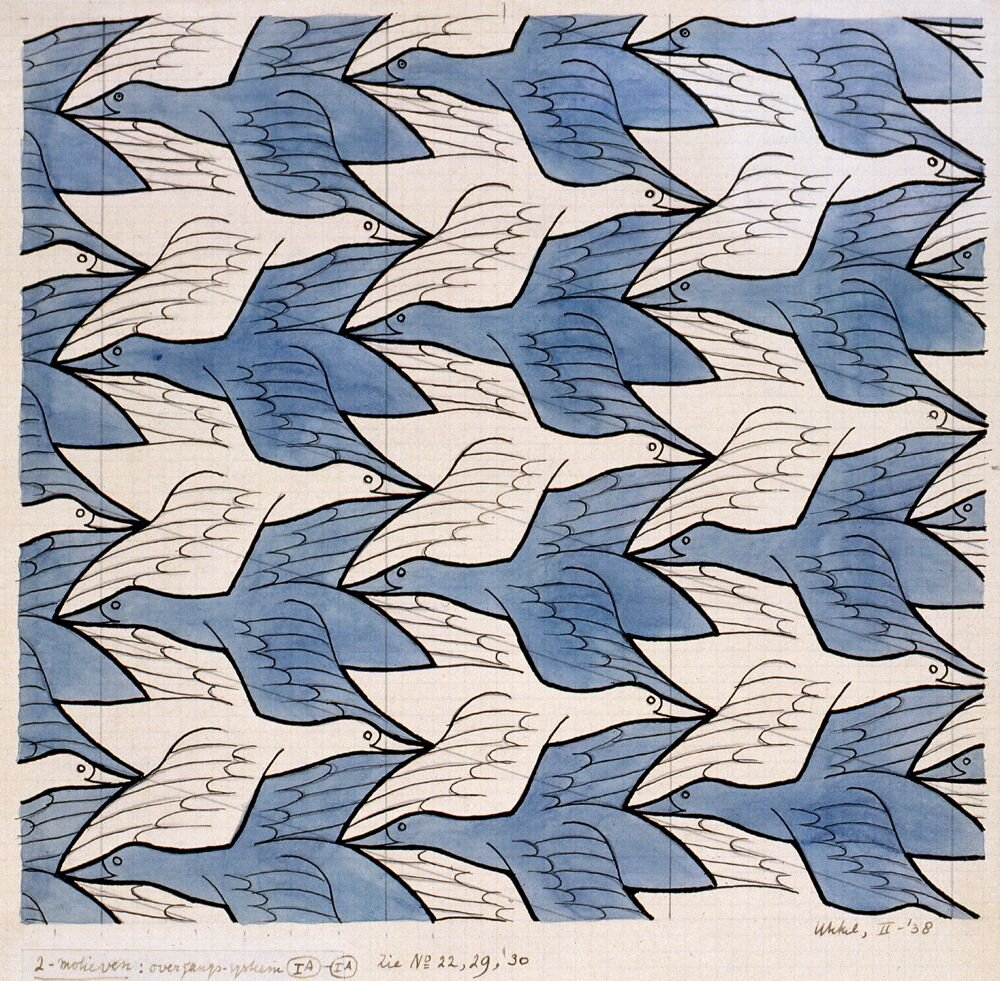

# ckuo4528_9103_tut2
## Quiz 8 

** Part one **

1. The imaging technique that I've chosen is artist MC Escher's iconic use of tessellations and optical illusions. His Two Birds (1938) artwork is the one that I will refering to in this report. 

2. There are a few aspects of this artwork that I would like to incorporate into the assignment: 

- 

- Colour contrast, both these artworks use white black and a pop of colour to create contrast. I 

3. 

Write a maximum of 100 words discussing which aspect of the example you'd like to incorporate into your project and why you believe it's a beneficial technique considering the assignment requirements.
