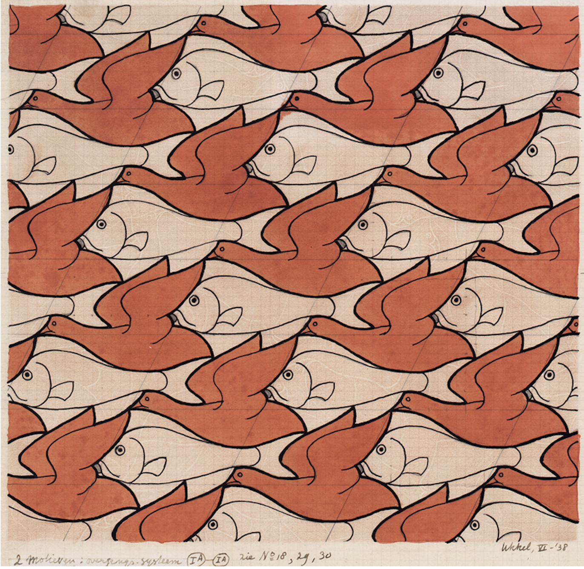

# ckuo4528_9103_tut2
## Quiz 8 

### **Part one: Imaging Technique Inspiration**

1. The imaging technique that I've chosen is artist MC Escher's iconic use of tessellations and optical illusions. His Two Birds and Bird Fish (1938) artworks are the ones that I will be refering to in this report. :bird: :fish:

2. There are a few aspects of this artwork that I would like to incorporate into the assignment: 

- Colour and contrast: both these artworks use white, black and a pop of colour to create contrast. This technique can be used in the major project especially for the artwork 'Dove of peace' by Pablo Picasso. We can modify the original artwork by creating iterations of the image and introducing more colours. 

- Tessellations are used to create a pattern where the geometric illustrations fit together without a gap. Geometrical transformations such as reflection and translations are used. This can be applied to the 'Dove of peace' by modifying the dove shape to repeat. 

3. 
| Two  Birds, 1938   | Bird Fish, 1938 |
| ----------- | ----------- |
|       |        |

### **Part two: Coding Technique Exploration**

1. Coding technique 

2. 
`const canvas = document.getElementById('myCanvas');
const ctx = canvas.getContext('2d');

const img = new Image();
img.src = 'dove-of-peace.png'; // Replace with a valid URL or path to Picasso's Dove of Peace

img.onload = function () {
  ctx.translate(canvas.width / 2, canvas.height / 2); // Move to the center of the canvas

  for (let i = 0; i < 12; i++) {
    ctx.save(); // Save the current transformation state
    ctx.rotate((Math.PI / 6) * i); // Rotate the canvas 30 degrees
    ctx.scale(1 - i * 0.08, 1 - i * 0.08); // Scale the dove smaller each time
    ctx.drawImage(img, -50, -50, 100, 100); // Draw the dove at the new orientation and scale
    ctx.restore(); // Restore to the original state before the next transformation
  }
};
`

Find a coding technique that could assist in implementing the imaging technique you selected in Part 1 of this quiz.
In no more than 100 words, discuss how this coding technique might help achieve or or contribute to the desired effect.
You're encouraged to draw inspiration from any coding language or toolkit.
Provide an image or screenshot showcasing the coding technique in action, along with a link to an example implementation (including a link to some example code).